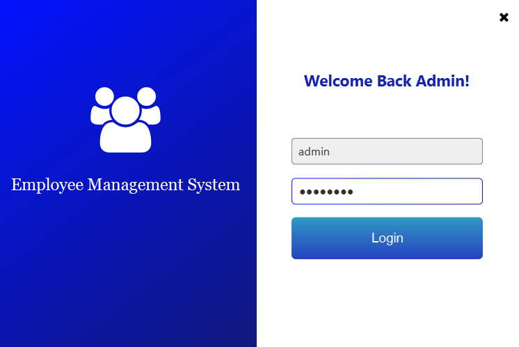
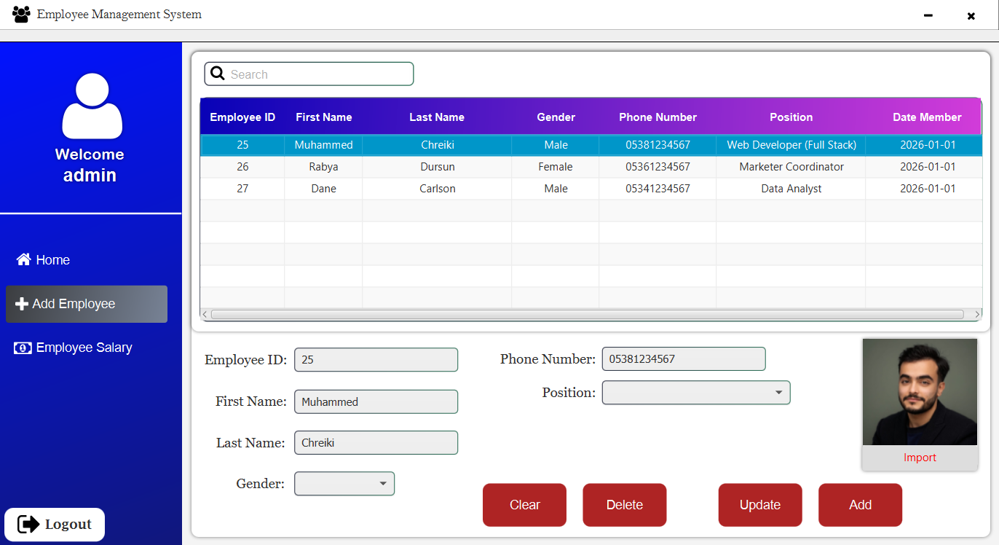
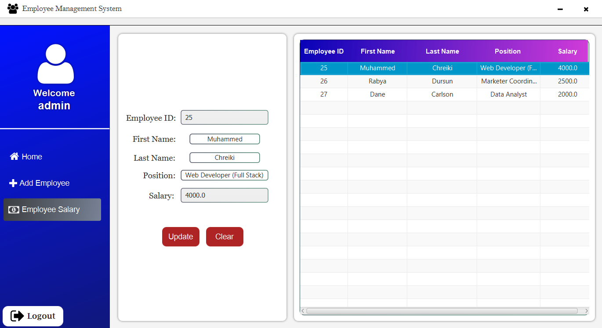

# Employee Management System

This project is an **Employee Management System** developed using **JavaFX** and **MySQL**.  
It is designed to manage employee information efficiently with secure **admin-only access**.

---

## Features

- Admin-only login system
- Full CRUD operations
  > Add, Delete, View, Update employee information
- Dashboard with a brief system overview
- Dedicated section for managing employee salaries
- JavaFX-based graphical user interface
- FontAwesomeFX icons support

---

## Technologies Used

- Java  
- JavaFX  
- MySQL  
- JDBC (MySQL Connector)  
- FontAwesomeFX  

---

## Project Requirements

To run this project, the following tools and libraries are required:

- Java JDK  
- JavaFX SDK  
- XAMPP or WAMP (for MySQL and phpMyAdmin)  
- mysql-connector-java.jar  
- fontawesomefx.jar (required for icons)

---

## Screenshots

### Admin Login Panel


### Dashboard


### Employee Management (CRUD)


### Salary Management


---

## Database

- Uses **MySQL** as the database system.
- Database can be managed via **phpMyAdmin**.
- Separate tables are designed for employee data and salary information.

---

## Installation and Setup

1. Clone the repository:
   ```bash
   git clone https://github.com/your-username/employee-management-system.git
   ```
2. Install the requirements:
    - Java JDK: https://www.oracle.com/tr/java/technologies/downloads/
    - JavaFX SDK: https://gluonhq.com/products/javafx/
    - Xampp: https://www.apachefriends.org/download.html
    - mysql-connector-java jar: https://mvnrepository.com/artifact/mysql/mysql-connector-java
    - fontawesomefx jar: https://mvnrepository.com/artifact/de.jensd/fontawesomefx/8.2

3. Open the project in an IDE  
  Open the project using an IDE such as IntelliJ IDEA, Eclipse, or NetBeans(Recommended).

4. Add required libraries  
  Add the following .jar files to your project dependencies:
    - `mysql-connector-java.jar`
    - `fontawesomefx.jar`
5. Set up the database
    - Start XAMPP and run MySQL.
    - Open phpMyAdmin.
    - Create a new database (e.g. employee_management).
    - Import `mysqldb.sql` into the database.

6. Configure database connection
  Update the database connection settings in the project:
     ```bash
     Connection connect = DriverManager.getConnection("jdbc:mysql://localhost/mysqldb", "root", "");
     ```
7. Configure JavaFX
  If you are using Java 11 or later, add the following VM options:
     ```bash
     --module-path /path/to/javafx/lib --add-modules javafx.controls,javafx.fxml
     ```
8. Run the application
    - Run the main application class.
    - Log in using an admin account (username: admin, password: admin123).
